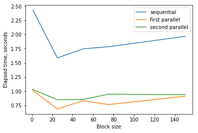
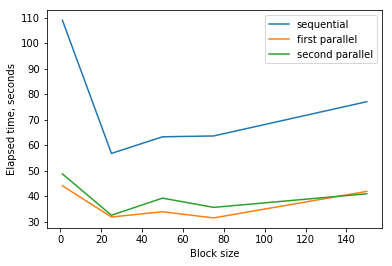

# Report

Parallel computing,
[lab1](https://github.com/Drapegnik/bsu/tree/master/parallel-computing/lab1) by
[Ivan Pazhitnykh](https://github.com/Drapegnik)

## task

_Исследование влияния размера матриц и блоков на время реализации блочного
алгоритма перемножения матриц на многоядерном `CPU`_

1. Программно реализовать (`С` или `C++`, `OpenMP`) алгоритмы точечного и
   блочного перемножения матриц.

- В блочном варианте не допускать повторяющихся одних и тех же вычислений.
- Программно реализовать `OpenMP`-версии алгоритмов точечного и блочного
  перемножения матриц.

2. Экспериментально исследовать влияние на время реализации алгоритмов:

- размеров матриц и блоков (случай `r=1` - обычный точечный алгоритм);
- выбора цикла `dopar` (внешний, внутренний), который служит для образования
  потоков вычислений;

3. Сравнить время реализации точечных алгоритмов с временем реализации блочных
   алгоритмов. Сравнивать как последовательные, так и параллельные версии
   программ.
4. Результаты экспериментов представить в виде графиков и (или) таблиц.

## notes

1. Для заполнения матриц `A` и `B` использовать случайные числа из диапазона от
   `−100` до `100`. Для получения случайных чисел использовать библиотечную
   функцию rand(), подключив заголовочный файл stdlib.h, или функции из
   заголовочного файла `random.h` (`С++11`).
2. Для вычислений выбрать параметры:

- `n1`, `n2`, `n3` – размеры матриц (рассмотреть не менее двух наборов размеров
  матриц: небольшие размеры (до `500`, если матрица квадратная) и размеры
  побольше (например, от `1500` до `2000`);
- `r` – размер блоков (рассмотреть несколько случаев: единицы, десятки, сотни).

```python
from tabulate import tabulate
from IPython.display import display, Markdown
import matplotlib.pyplot as plt
import numpy as np

headers = ['block size', 'sequential time, s', 'parallel first loop time, s', 'parallel second loop time, s']
display(Markdown('## results'))

file = open('output.txt', 'r')
for line in file:
    title = 'matrix {}x{}'.format(size, size)
    size, rows = map(int, line.split())
    display(Markdown('### {}'.format(title)))
    table = [file.readline().split() for _ in range(rows)]
    display(Markdown(tabulate(table, headers, tablefmt='pipe')))

    data = np.array(table)
    labels = ['sequential', 'first parallel', 'second parallel']
    block_sizes = list(map(int, data[:,0]))
    plt.xlabel('Block size')
    plt.ylabel('Elapsed time, seconds')
    plots = []
    for i in range(1, 4):
        plots.append(plt.plot(block_sizes,  list(map(float, data[:,i])), label=labels[i-1])[0])
    plt.legend(handles=plots)
    plt.show()
```

## results

### matrix 1500x1500

| block size | sequential time, s | parallel first loop time, s | parallel second loop time, s |
| ---------: | -----------------: | --------------------------: | ---------------------------: |
|          1 |              2.431 |                       1.014 |                        1.029 |
|         25 |              1.587 |                       0.687 |                         0.85 |
|         50 |              1.747 |                       0.832 |                        0.854 |
|         75 |              1.785 |                       0.765 |                        0.948 |
|        150 |              1.968 |                       0.911 |                        0.939 |



### matrix 450x450

| block size | sequential time, s | parallel first loop time, s | parallel second loop time, s |
| ---------: | -----------------: | --------------------------: | ---------------------------: |
|          1 |            108.954 |                      44.061 |                        48.69 |
|         25 |              56.74 |                      31.809 |                       32.504 |
|         50 |             63.258 |                      33.871 |                       39.211 |
|         75 |             63.586 |                      31.452 |                       35.585 |
|        150 |             77.018 |                       41.86 |                       40.913 |


